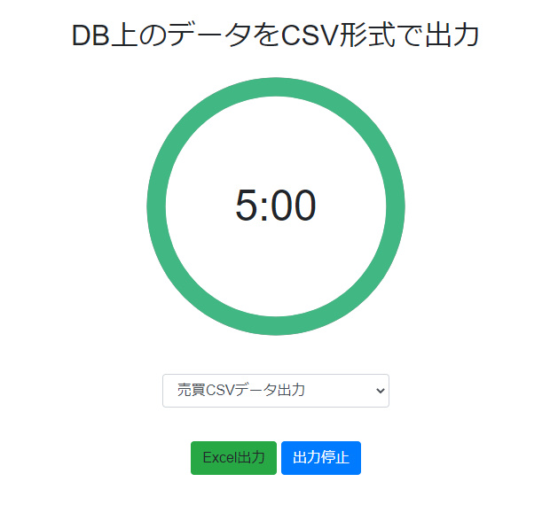

# DB上のデータをCSV形式で出力



### 取り付けます指示
1. プロジェクト用の`csv_export`データベースを作成します。
2. プロジェクトのルートから、`cp .env.example .env` を実行します。
3. .env」ファイルを設定する
4. プロジェクトのルートフォルダから、`composer update`を実行します。
5. プロジェクトのルートフォルダから `php artisan key:generate` を実行する
6. docker build後、プロジェクトのルートフォルダから `php artisan migrate`を実行します。

### Dockerビルド
1. プロジェクトのルートフォルダで、`docker-compose up -d`を実行する。
2. プロジェクトのルート端末でphp artisan schedule:testを実行します。
3. このようなコマンドが表示されます。
     ```
     Which command would you like to run?:
     [0] "C:\xampp\php\php.exe" "artisan" rent:data
     [1] "C:\xampp\php\php.exe" "artisan" sales:data
     ```
5. ここで`rent：data`は`賃貸`、`sales：data`は`売買`
6. 出力形式を確認して`0`または`1`を入力し、Enter件を押します。
7. 二つの項目を出力するには、次のコマンドを入力してください。
     ```
     php artisan schedule:work
     ```

### 出力ファイルパス
     projects root folder/public/backup/

### Laravel Auth License
Laravel-auth is licensed under the [MIT license](https://opensource.org/licenses/MIT). Enjoy!